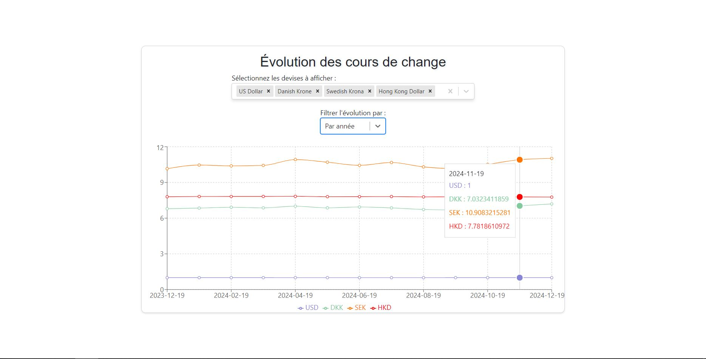

<br />
<div align="center">
  <a href="https://github.com/Mysterken/instant-money">
    
  </a>

<h3 align="center">instant-money</h3>

  <p align="center">
    A web app that allows you to instantly get the current exchange rate for multiple currencies.
  </p>

[](https://www.codefactor.io/repository/github/mysterken/instant-money)

</div>

## About The Project

This is a course project made with my group members, made in a few days.  
It allows you to get the current exchange rate for multiple currencies and cryptocurrencies and display them in a graph.
We use the [FreecurrencyAPI](https://freecurrencyapi.com/) to get the exchange rates
and [CoinGecko](https://www.coingecko.com/) to get the cryptocurrency exchange rates.

### Built With

- [vite](https://vite.dev/) for the frontend bundling
- [React](https://react.dev/) for the frontend
- [Symfony](https://symfony.com/) for the backend
- [Docker](https://www.docker.com/) for the containerization
- [sqlite](https://www.sqlite.org/index.html) for the database

## Getting Started

To get a local copy up and running follow these simple steps.

### Prerequisites

- [Docker Compose](https://docs.docker.com/compose/install/)
- [Make](https://www.gnu.org/software/make/) (Optional)

### Installation

1. Clone the repo
>   ```sh
>   git clone
>   ```
   
2. Add API keys to an `.env.local` file
>   ```sh
>   cd money-api
>   touch .env.local
>   ```
>   and add the API keys to the `.env.local` file
>    ```dotenv
>    CURRENCY_APIKEY=your-currency-api-key
>    CRYPTO_APIKEY=your-crypto-api-key
>    ```

3. Build and run the containers
>   ```sh
>   docker compose build --no-cache
>   docker compose up --pull always -d --wait
>   ```
>    or with make
>    ```sh
>    make build
>    make up
>    ```

4. Open `https://localhost` in your browser
<br><br>
5. To stop the containers
>   ```sh
>   docker compose down --remove-orphans
>   ```
>   or with make
>   ```sh
>    make down
>   ```

### Notes

While there is a working backend for the cryptocurrencies, the frontend side of it is not yet implemented.
